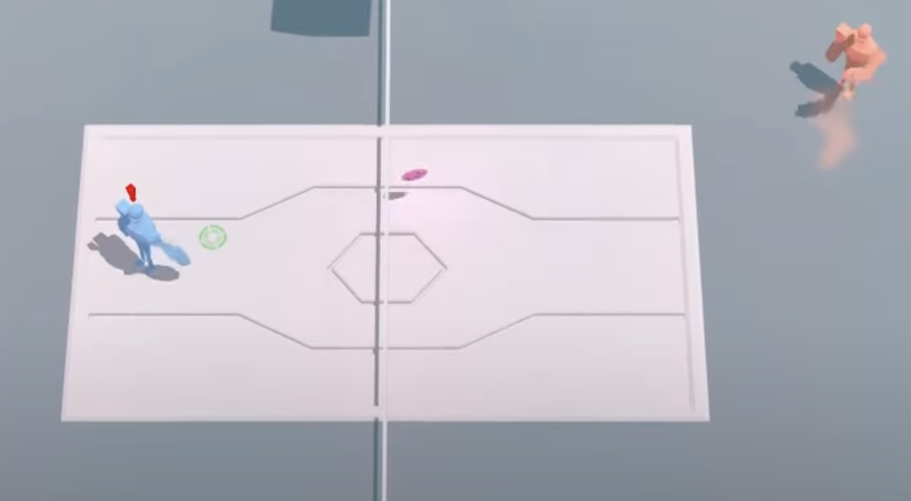

# hypervolley

Built by Ryan Yeung and Cameron Gorrie

Two-player local competitive tennis game (Windows only), written in Java and libgdx

## stuff I remember about the project

1. It requires a gamepad (or two!) to play (via XInput)
2. It makes extensive use of preallocated arrays to avoid invoking the garbage collector
3. It has custom pixel shaders which override the built-in libgdx system. Glossy reflections, soft shadows, motion blur, and more unnecessary graphical effects that I had a lot of fun coding.
4. It has a rudimentary AI so you can play single-player
5. It's deterministic -- rather than have the ball follow a ballistic simulation, the path of the ball is precomputed. This means the game loop is independent of framerate. I did this because I wanted to make a networked version of the game.
5. It has sound effects
6. It has a menu

## stuff I don't remember about the project

A lot more.
